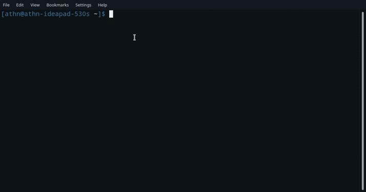

# save-me
save-me is a command-line tool for saving your work files with just a single command through your terminal to common cloud space. Users are required to register for the application. Upon registration, users can upload, list and delete files on the common cloud space with specific terminal commands. The application uses python for command-line interface and the server code is written in Express. 
<br>

<br>
[!help](/Screenshots/help.png)
# Installation
* clone the repository
```
git clone https://github.com/AthN3090/save-me
```
```
cd save-me
```
* setup
```
pip install .
```
# How to use

* User registeration 
```
saveme -r
```


* File upload
```
saveme [-u user] [-f filename]
```


* Download file
```
saveme [-u user] [-s filename]
```


* List files
```
saveme [-u user] -l
```


* Delete file
```
saveme [-u user] [-d filename]
```


* Delete all files
```
saveme [-u user] -da
```

